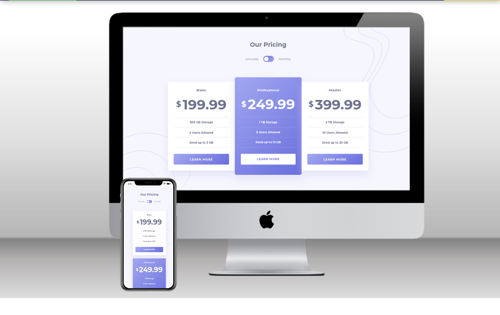

# Frontend Mentor - Pricing component with toggle solution

This is a solution to the [Pricing component with toggle challenge on Frontend Mentor](https://www.frontendmentor.io/challenges/pricing-component-with-toggle-8vPwRMIC). Frontend Mentor challenges help you improve your coding skills by building realistic projects. 

## Table of contents

- [Overview](#overview)
  - [The challenge](#the-challenge)
  - [Screenshot](#screenshot)
  - [Links](#links)
- [My process](#my-process)
  - [Built with](#built-with)
  - [Useful resources](#useful-resources)
- [Author](#author)

## Overview

### The challenge

Users should be able to:

- View the optimal layout for the component depending on their device's screen size
- Control the toggle with both their mouse/trackpad and their keyboard
- **Bonus**: Complete the challenge with just HTML and CSS

### Screenshot

### Links

- Solution URL: [https://github.com/diogohenriquesc/fm-pricing-component](https://github.com/diogohenriquesc/fm-pricing-component)
- Live Site URL: [https://fm-pricing-component-beryl.vercel.app/](https://fm-pricing-component-beryl.vercel.app/)

## My process

### Built with

- Semantic HTML5 markup
- CSS custom properties
- Flexbox
- CSS Grid
- Mobile-first workflow
- [SCSS](https://sass-lang.com/) - CSS Preprocessor

### Useful resources

- [On Designing and Building Toggle Switches - Sara Soueidan](https://www.sarasoueidan.com/blog/toggle-switch-design/) - This helped me build the accessible switcher.
- [How SVG Line Animation Works - Chris Coyier](https://css-tricks.com/svg-line-animation-works/) - This helped me make the SVG's line animation.

## Author

- Website - [diogohenriquesc](https://github.com/diogohenriquesc)
- Frontend Mentor - [@diogohenriquesc](https://www.frontendmentor.io/profile/diogohenriquesc)